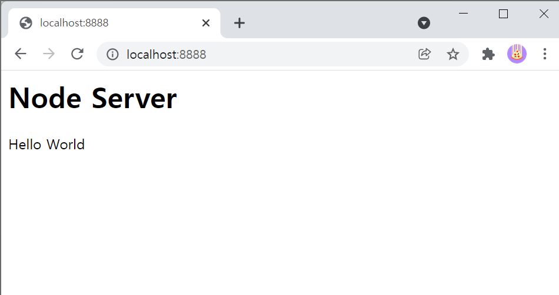
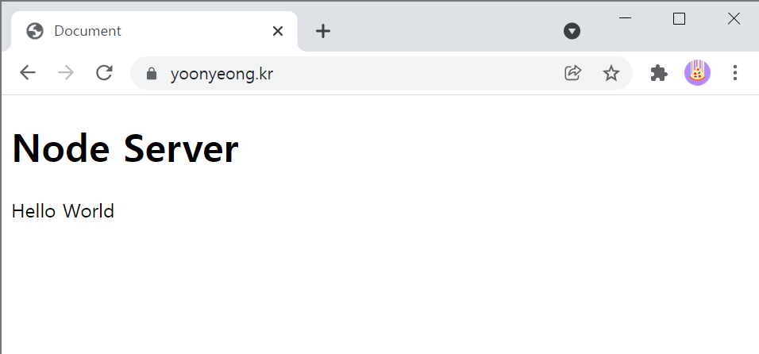

# **Simple Node Server** (http, https, http2)

## **create server**

### start server

    node httpServer
    node httpsServer
    node http2Server

### images

- http server
  

- https server | http2 secure server
  

---

## **req**

    node incomingMessage

## **res**

    node serverResponse
    node streamRes

---
